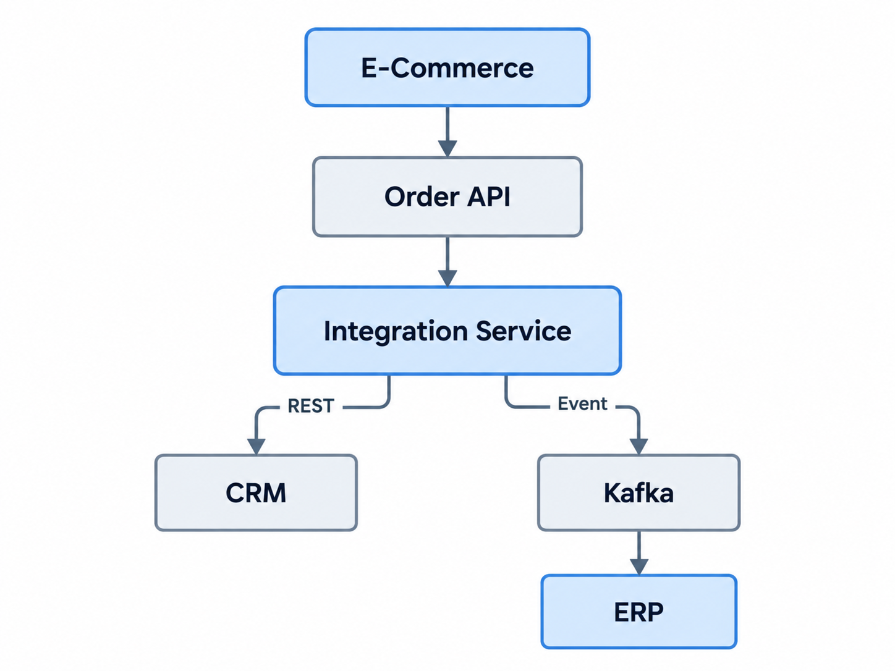
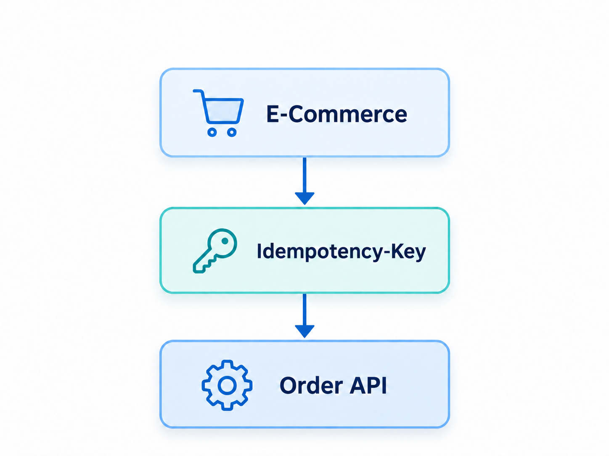
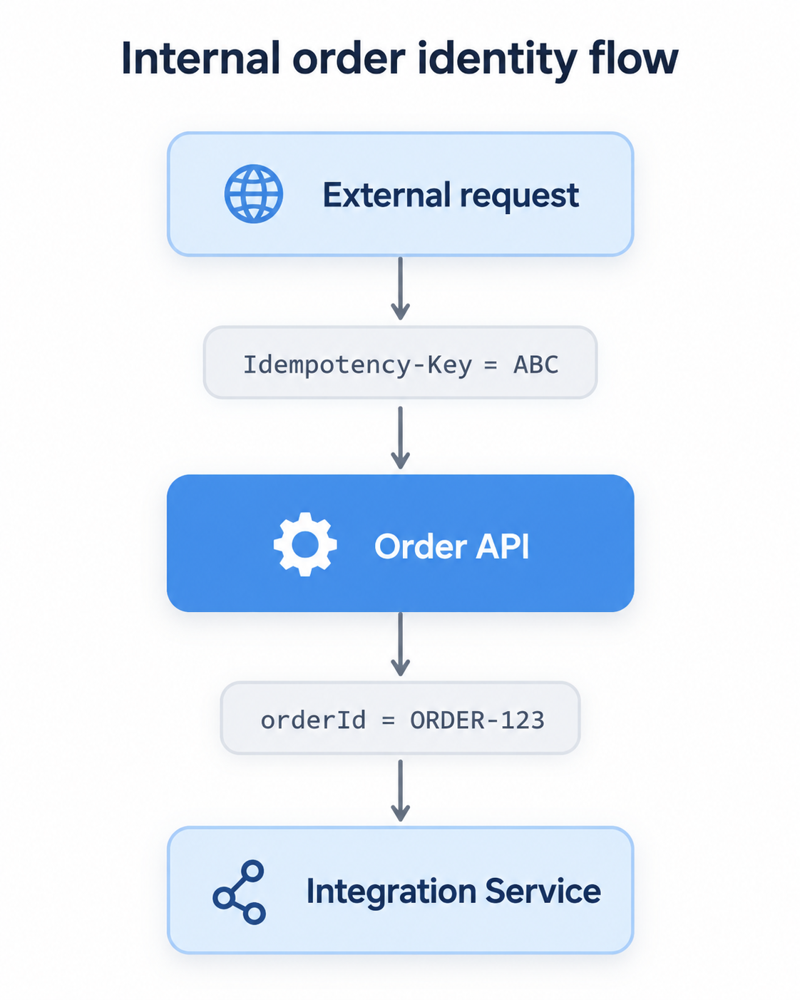
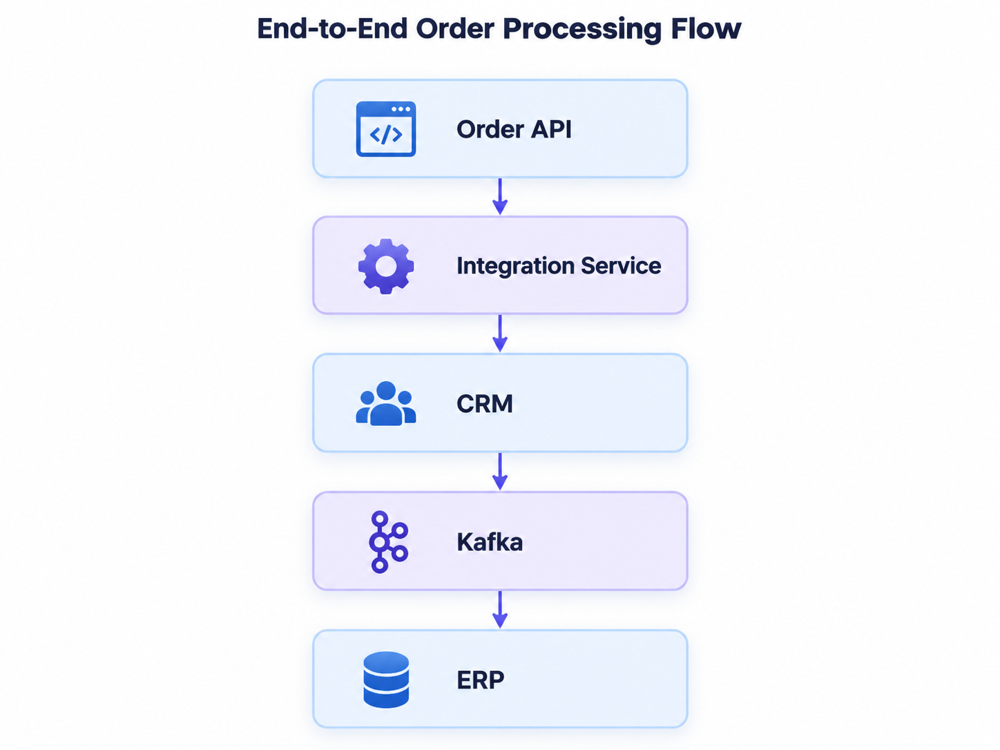
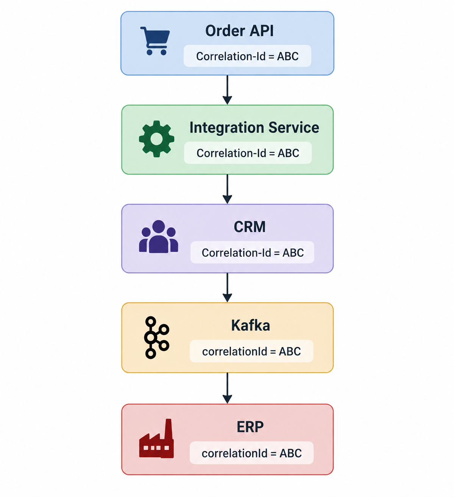
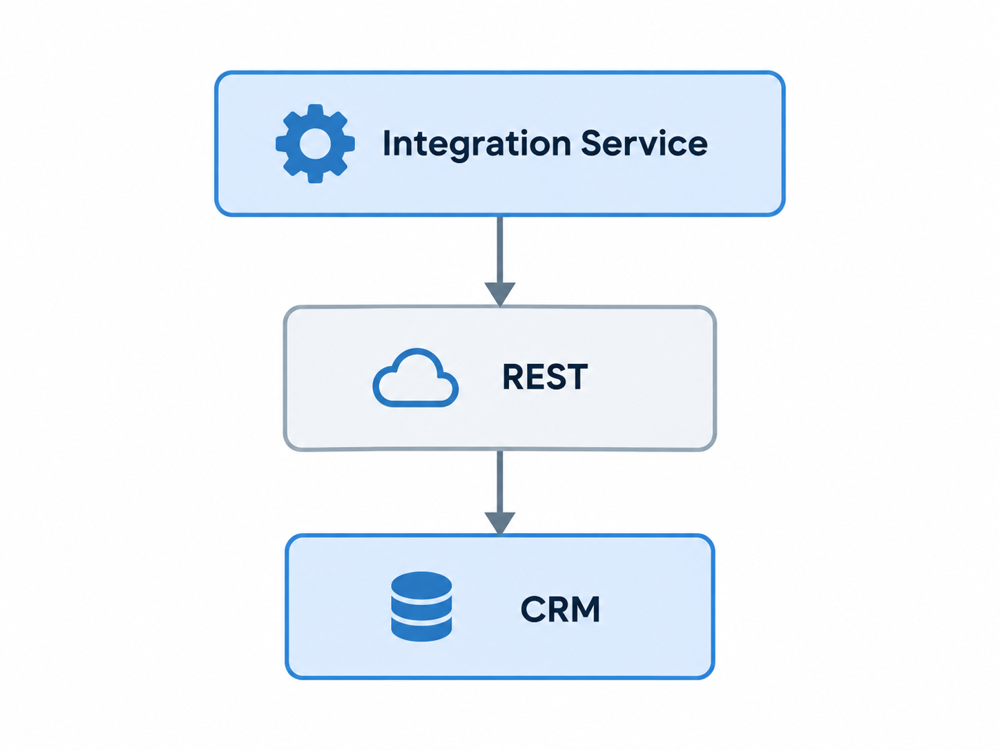
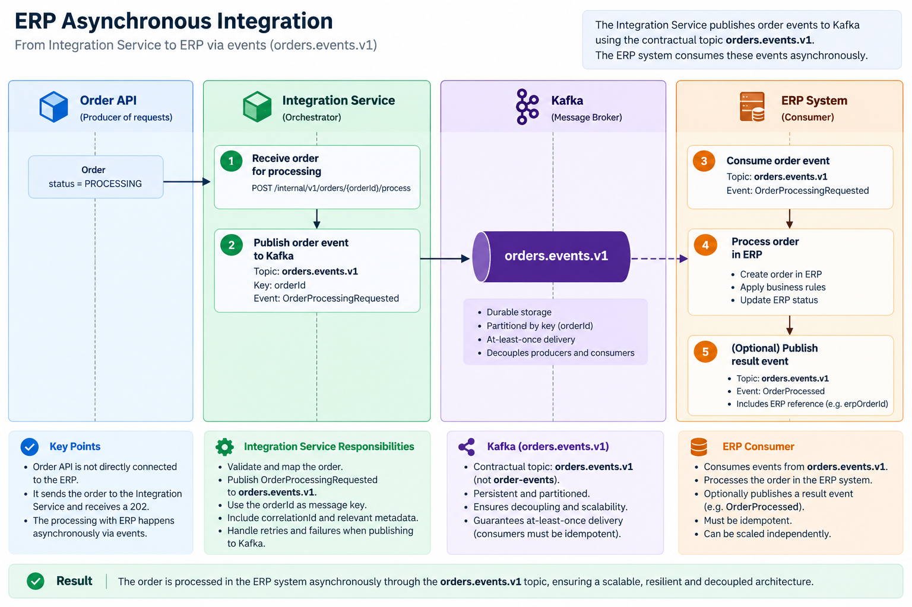
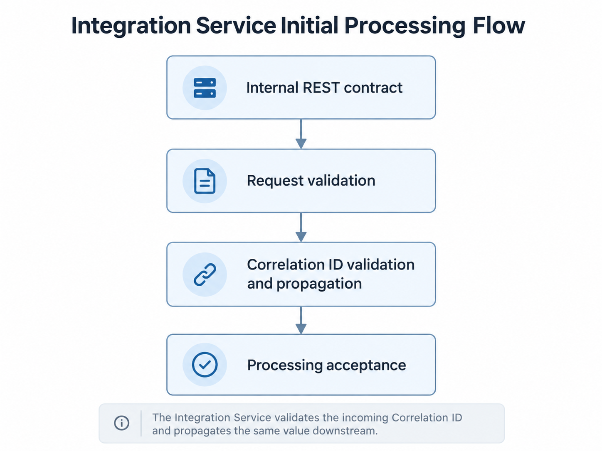
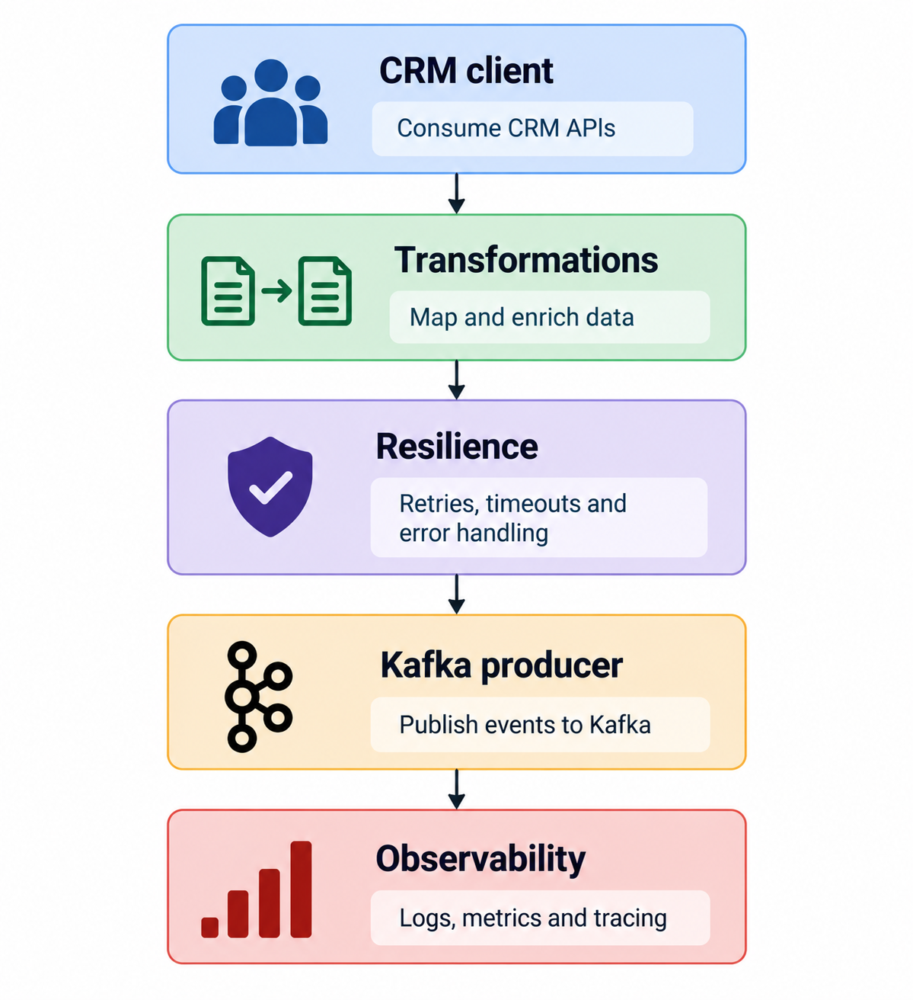

# Integration Service API Contract

## Overview

The Integration Service is the internal orchestration layer of the enterprise integration platform.

It receives orders that have already been validated and accepted by the Order API and coordinates the integrations required to continue order processing.

The Integration Service is responsible for:

- Receiving normalized order data from the Order API
- Propagating correlation identifiers
- Orchestrating synchronous downstream integrations
- Transforming data between system-specific models
- Publishing asynchronous integration events
- Applying resilience policies to downstream dependencies
- Providing consistent internal API responses and errors

The Integration Service is not intended to be exposed directly to external consumers.

The external e-commerce platform communicates only with the Order API.

---

## Architecture Context

The internal communication flow is:



The Order API owns:

- External REST contract
- Request validation
- `Idempotency-Key`
- Initial order persistence
- Internal `orderId`
- Initial order status
- External error contract

The Integration Service owns:

- Integration orchestration
- Downstream transformations
- CRM communication
- Kafka event publication
- Integration resilience
- Integration-level traceability

---

# Process Order

## Endpoint

`POST /internal/v1/orders/{orderId}/process`

This endpoint is intended exclusively for service-to-service communication.

---

## Path Parameter

### `orderId`

Required.

Internal order identifier generated by the Order API.

The value must be a valid UUID.

Example:

```text
b243423f-8047-49ea-b79f-50027400c022
```

The `orderId` becomes the stable identifier of the order throughout the internal integration flow.

---

# Request Headers

## `X-Correlation-Id`

Required.

The Order API must propagate the effective correlation identifier to the Integration Service.

Example:

```text
X-Correlation-Id: 11111111-1111-4111-8111-111111111111
```

Unlike the external Order API contract, the Integration Service does not generate a correlation identifier when it is missing.

Once a request has entered the enterprise integration platform, internal services are expected to propagate the existing identifier.

The correlation identifier will later be propagated to:

- CRM requests
- Kafka events
- Application logs
- Metrics
- Distributed traces

---

# Idempotency

The external `Idempotency-Key` is not propagated to the Integration Service.

The external idempotency relationship is:



After the Order API has accepted the request, the platform has a stable internal identifier:

```text
orderId
```

Internal processing therefore uses `orderId` as the identity of the order operation.

Conceptually:



Repeated processing requests for the same `orderId` must not result in inconsistent or duplicate business effects.

The exact downstream duplicate-protection strategy will evolve as CRM and Kafka integrations are implemented.

---

# Request Body

Example:

```json
{
  "externalOrderId": "WEB-2026-000123",
  "customer": {
    "customerId": "CUST-10045",
    "email": "customer@example.com"
  },
  "items": [
    {
      "productId": "PROD-001",
      "quantity": 2,
      "unitPrice": 29.95
    }
  ],
  "currency": "EUR",
  "shippingAddress": {
    "addressLine1": "123 Example Street",
    "city": "Seville",
    "postalCode": "41001",
    "country": "ES"
  },
  "acceptedAt": "2026-09-07T10:00:00Z"
}
```

---

# Request Fields

## `externalOrderId`

Required.

Identifier assigned by the source e-commerce platform.

Requirements:

- Must not be empty
- Maximum length: 100 characters

Example:

```text
WEB-2026-000123
```

---

## `customer`

Required.

Customer information required by downstream integrations.

---

## `customer.customerId`

Optional.

Identifier of the customer in the source system.

For registered customers, this value is propagated from the Order API.

For guest orders, this field may be null or omitted when no registered
customer identity is available.

Requirements:

- When provided, must not be empty or blank
- Maximum length: 100 characters

Example:

```text
CUST-10045
```

---

## `customer.email`

Required.

Requirements:

- Must not be empty
- Must contain a valid email address
- Maximum length: 254 characters

Example:

```text
customer@example.com
```

---

## `items`

Required.

Collection of order items.

Requirements:

- Must contain at least one item

---

## `items[].productId`

Required.

Requirements:

- Must not be empty
- Maximum length: 100 characters

Example:

```text
PROD-001
```

---

## `items[].quantity`

Required.

Requirements:

- Must be an integer
- Must be greater than zero

Example:

```text
2
```

---

## `items[].unitPrice`

Required.

Requirements:

- Must be greater than or equal to `0.01`

Example:

```text
29.95
```

---

## `currency`

Required.

ISO 4217 currency code.

Requirements:

- Exactly three uppercase alphabetic characters

Example:

```text
EUR
```

---

## `shippingAddress`

Required.

Shipping destination received from the Order API.

---

## `shippingAddress.addressLine1`

Required.

Requirements:

- Must not be empty
- Maximum length: 200 characters

---

## `shippingAddress.addressLine2`

Optional.

Maximum length:

```text
200 characters
```

---

## `shippingAddress.city`

Required.

Requirements:

- Must not be empty
- Maximum length: 100 characters

---

## `shippingAddress.postalCode`

Required.

Requirements:

- Must not be empty
- Maximum length: 20 characters

---

## `shippingAddress.country`

Required.

ISO 3166-1 alpha-2 country code.

Requirements:

- Exactly two uppercase alphabetic characters

Example:

```text
ES
```

---

## `acceptedAt`

Required.

Timestamp generated by the Order API when the order was originally accepted.

The timestamp must use ISO 8601 date-time format.

Example:

```text
2026-09-07T10:00:00Z
```

This value represents the original order acceptance time and must not be regenerated by the Integration Service.

---

# Successful Processing

When the Integration Service accepts responsibility for processing the order, it returns:

`202 Accepted`

Example response:

```json
{
  "orderId": "b243423f-8047-49ea-b79f-50027400c022",
  "status": "PROCESSING",
  "correlationId": "11111111-1111-4111-8111-111111111111",
  "processingAcceptedAt": "2026-09-07T10:00:01Z"
}
```

Response header:

```text
X-Correlation-Id: 11111111-1111-4111-8111-111111111111
```

---

# Processing Status

## `PROCESSING`

The Integration Service has accepted responsibility for continuing the integration workflow.

This does not mean that ERP processing has completed.

The intended processing model is:



ERP processing remains asynchronous.

---

# Correlation and Traceability

The Integration Service must preserve the incoming:

```text
X-Correlation-Id
```

throughout the integration flow.

Example:



The identifier represents the distributed integration flow associated with the current request.

---

# Correlation ID vs Order ID

These identifiers have different responsibilities.

## `orderId`

Identifies the order.

It remains stable across retries and downstream processing.

Example:

```text
b243423f-8047-49ea-b79f-50027400c022
```

---

## `X-Correlation-Id`

Identifies and traces a particular distributed integration flow or attempt.

Example:

```text
11111111-1111-4111-8111-111111111111
```

The same order may potentially be processed through more than one request attempt while retaining the same `orderId`.

---

# Downstream Processing Model

The final Integration Service processing model will combine synchronous and asynchronous integration.

## CRM

CRM communication will be synchronous REST communication.

Conceptually:



The Integration Service requires an immediate CRM result before continuing the relevant orchestration flow.

---

## ERP

ERP processing will be decoupled through Kafka.

Conceptually:



The original internal HTTP request does not wait for ERP processing to finish.

---

# Event Publication

The Integration Service will eventually publish:

```text
ORDER_CREATED
```

to:

```text
orders.events.v1
```

The Kafka message key will be:

```text
orderId
```

This helps preserve ordering for events associated with the same order.

The event will also contain:

```text
eventId
orderId
correlationId
occurredAt
eventVersion
```

The formal event contract is documented separately.

---

# Error Model

The Integration Service uses a consistent Problem Details representation.

Error responses use:

```text
Content-Type: application/problem+json
```

Example:

```json
{
  "type": "https://example.com/problems/integration-validation",
  "title": "Integration request validation failed",
  "status": 400,
  "detail": "One or more request fields are invalid.",
  "instance": "/internal/v1/orders/b243423f-8047-49ea-b79f-50027400c022/process",
  "errorCode": "INT-VALIDATION-001",
  "correlationId": "11111111-1111-4111-8111-111111111111",
  "timestamp": "2026-09-07T10:00:01Z"
}
```

The response must also contain:

```text
X-Correlation-Id
```

when an effective correlation identifier is available.

---

# HTTP Status Codes

## `202 Accepted`

The Integration Service has accepted responsibility for continuing processing.

Response status:

```text
PROCESSING
```

This does not indicate that asynchronous ERP processing has completed.

---

## `400 Bad Request`

The internal request is invalid.

Possible causes include:

- Invalid request body
- Missing mandatory field
- Malformed JSON
- Missing `X-Correlation-Id`
- Invalid correlation UUID
- Invalid `orderId` UUID
- Invalid email
- Invalid quantity
- Invalid currency
- Invalid country

Example error codes:

```text
INT-VALIDATION-001
INT-VALIDATION-002
INT-VALIDATION-003
INT-VALIDATION-004
```

---

## `409 Conflict`

The processing request conflicts with previously known information for the same order.

A future example may be:

```text
Same orderId
+
different order content
```

Error code:

```text
INT-CONFLICT-001
```

The exact duplicate-protection implementation will evolve as downstream processing is introduced.

---

## `422 Unprocessable Entity`

The request is structurally valid but cannot be processed because of an integration or business rule.

Potential examples include:

- Unsupported order state
- Unsupported downstream processing condition
- Invalid integration transition

Error code:

```text
INT-BUSINESS-001
```

---

## `503 Service Unavailable`

A required downstream integration dependency is temporarily unavailable.

Potential dependencies include:

- CRM
- Kafka broker

Example error code:

```text
INT-DEPENDENCY-001
```

Retry and circuit-breaker behavior will be defined when resilience policies are implemented.

---

## `500 Internal Server Error`

An unexpected technical error occurred.

Internal implementation details must not be exposed to callers.

Error code:

```text
INT-INTERNAL-001
```

---

# Current Implementation Scope

The Integration Service will be implemented incrementally.

Initial implementation:



Later phases will introduce:



This incremental approach keeps each architectural concern independently testable.

---

# Security

The endpoint is an internal service-to-service API.

Authentication and authorization are outside the scope of the initial implementation.

A production implementation would require an appropriate service-to-service security mechanism such as:

- OAuth 2.0 client credentials
- Mutual TLS
- Workload identity
- API gateway or service-mesh authorization

Security will be addressed in a later architecture phase.

---

# Design Principles

The Integration Service follows these principles:

- Contract-first integration design
- Clear separation between API exposure and integration orchestration
- Correlation propagation
- Explicit synchronous and asynchronous boundaries
- Stable internal order identity
- Consistent error contracts
- Resilience by design
- Observability by design
- Stateless processing where possible
- No exposure of downstream implementation details
- Incremental introduction of infrastructure

---

# Related Documentation

Architecture overview:

`docs/architecture.md`

Order API contract:

`docs/api/order-api-contract.md`

Order API OpenAPI specification:

`docs/api/order-api.yaml`

Integration Service OpenAPI specification:

`docs/api/integration-service.yaml`

Order event documentation:

`docs/events/order-created-event.md`

AsyncAPI specification:

`docs/events/asyncapi.yaml`

Order event JSON Schema:

`docs/events/order-created-event.schema.json`

Architecture Decision Records:

`docs/decisions/`