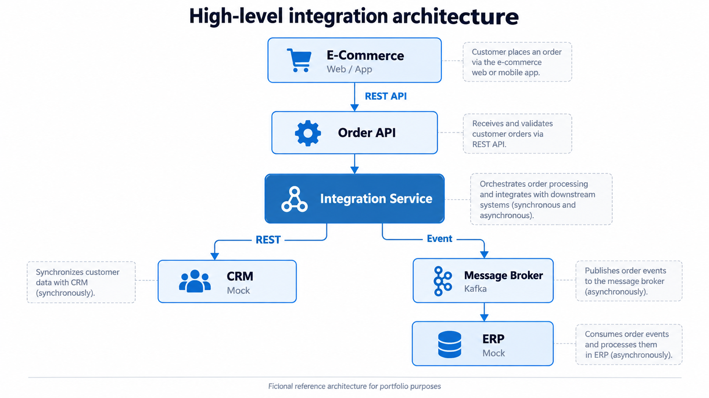

# Architecture

## 1. Overview

This project represents a fictional enterprise integration architecture for an e-commerce company.

The objective is to demonstrate how different enterprise systems can communicate using a combination of synchronous APIs and asynchronous event-driven integration.

The architecture focuses on:

- Loose coupling
- Resilience
- Scalability
- Traceability
- Clear separation of responsibilities
- Failure isolation
- Maintainability

---

## 2. High-Level Architecture

The architecture consists of the following main components:

- E-Commerce Application
- Order API
- Integration Service
- CRM Mock
- Message Broker
- ERP Mock

---

## 3. Components

### 3.1 E-Commerce Application

Represents the external application used by customers to create orders.

The application communicates with the platform through the Order API.

Communication:

- Protocol: HTTP
- Style: REST
- Format: JSON

---

### 3.2 Order API

The Order API is the entry point for order-related operations.

Responsibilities:

- Receive incoming order requests
- Validate request structure
- Validate mandatory fields
- Generate or propagate correlation identifiers
- Forward valid requests to the integration layer
- Return a consistent API response

The Order API should not contain integration-specific orchestration logic.

---

### 3.3 Integration Service

The Integration Service is responsible for coordinating interactions between enterprise systems.

Responsibilities:

- Integration orchestration
- Data transformation
- Routing
- Communication with downstream systems
- Event publishing
- Error handling
- Correlation and traceability

The Integration Service isolates the Order API from implementation details of backend systems.

---

### 3.4 CRM Mock

The CRM Mock represents an external Customer Relationship Management system.

Customer information must be synchronized during order processing.

Communication with the CRM is synchronous because the integration flow needs to know whether the CRM operation succeeded before continuing with the relevant synchronous processing.

Communication:

- Protocol: HTTP
- Style: REST
- Mode: Synchronous

---

### 3.5 Message Broker

Apache Kafka is used as the message broker for asynchronous communication.

Its purpose is to decouple the Integration Service from downstream order processing.

Benefits include:

- Temporal decoupling
- Failure isolation
- Independent scalability
- Asynchronous processing
- Event replay capabilities
- Improved resilience

---

### 3.6 ERP Mock

The ERP Mock represents an enterprise resource planning system responsible for processing orders.

Instead of being invoked directly by the Integration Service, the ERP consumes order events from Kafka.

Communication:

- Technology: Apache Kafka
- Mode: Asynchronous
- Pattern: Event-driven integration

This allows the ERP to be temporarily unavailable without preventing the upstream API from accepting new orders.

---

## 4. Main Integration Flow

The main order flow is:

1. A customer creates an order through the E-Commerce application.
2. The E-Commerce application sends the order to the Order API.
3. The Order API validates the request.
4. The request is forwarded to the Integration Service.
5. The Integration Service synchronizes the required customer information with the CRM using REST.
6. The Integration Service publishes an order event to Kafka.
7. The ERP consumes the event asynchronously.
8. The ERP processes the order.

---

## 5. Communication Styles

The architecture deliberately combines synchronous and asynchronous communication.

### Synchronous communication

Used when an immediate response is required.

Examples:

- E-Commerce → Order API
- Order API → Integration Service
- Integration Service → CRM

### Asynchronous communication

Used when downstream processing does not need to block the original request.

Example:

- Integration Service → Kafka → ERP

The reasoning behind this decision is documented in:

`docs/decisions/ADR-001-synchronous-vs-asynchronous-integration.md`

---

## 6. Error Handling

The architecture will progressively introduce a consistent error-handling strategy.

Planned mechanisms include:

- Standardized API errors
- Validation errors
- Timeouts
- Retry policies
- Circuit breakers
- Dead-letter handling
- Business and technical error separation

Errors should provide enough information for troubleshooting without exposing internal implementation details.

---

## 7. Resilience

External systems must be considered unreliable by design.

The following resilience mechanisms will be evaluated and implemented:

- Timeouts
- Retries with backoff
- Circuit breakers
- Dead-letter topics
- Idempotent consumers
- Graceful degradation

The architecture should prevent failures in one downstream system from causing cascading failures across the platform.

---

## 8. Idempotency

Asynchronous systems may deliver the same message more than once.

Consumers must therefore be designed to safely process duplicate events.

The ERP consumer will eventually implement an idempotency mechanism based on a unique order or event identifier.

---

## 9. Traceability

A correlation identifier will be propagated across the complete integration flow.

Example:

`E-Commerce → Order API → Integration Service → Kafka → ERP`

This will allow a single business transaction to be traced across multiple services.

---

## 10. Observability

The solution will progressively implement:

- Structured logging
- Correlation IDs
- Health checks
- Metrics
- Distributed tracing

Observability will be treated as an architectural concern rather than an implementation afterthought.

---

## 11. Security

Security will be introduced progressively.

Potential mechanisms include:

- API authentication
- Authorization
- TLS
- Secure configuration management
- Secret management
- Input validation

No real credentials or secrets will be stored in the repository.

---

## 12. Architecture Principles

The project follows these principles:

### Loose Coupling

Systems should know as little as possible about the internal implementation of other systems.

### Separation of Concerns

API exposure, orchestration and backend processing should remain separated.

### Resilience by Design

Failures of external dependencies are expected and must be handled explicitly.

### Observability by Design

Integration flows must be traceable across system boundaries.

### Contract First

API and event contracts should be defined before implementation whenever possible.

### Technology Independence

Architecture decisions should be driven by integration requirements rather than by a specific middleware product.
